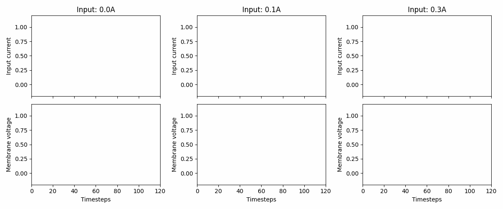
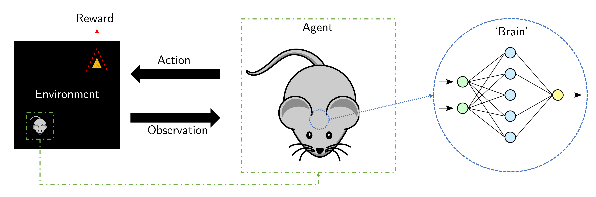

(getting-started)=
# Getting started with neural controls

Spiking neural systems are useful for control systems because we can exploit the temporal dynamics to react to stimulus in the environment.
On this page, we will gloss over two types of nonlinear neuron models and provide examples on how we can solve simple problems with very simple mathematics and very few neurons

## Leaky integrator neuron models

One of the simplest neuron-like models is the [leaky integrator](https://en.wikipedia.org/wiki/Leaky_integrator).
It simply takes some input current and integrates it over time.

:::{figure-md} started-li


A leaky integrator that integrates current over time into its membrane potential.
The left panel shows a constant input current while the right shows a current oscillating between $[-0.1;0.1]A$.
Note that the leaky integrator can produce *negative* membrane voltages.
:::

This type of neuron provides a continuous voltage, indicating the amount of current it builds up over time.
The neuron voltage ($v$) and current ($i$) evolves as follows:

$$
\begin{align*}
    \dot{v} &= 1/\tau_{\text{mem}} (v_{\text{leak}} - v + i) \\
    \dot{i} &= -1/\tau_{\text{syn}} i
\end{align*}
$$

The neuron model includes [parameters](https://norse.github.io/norse/generated/norse.torch.functional.leaky_integrator.LIParameters.html#norse.torch.functional.leaky_integrator.LIParameters) like the synaptic integration time constant $\tau_{syn}$ that determines the speed with which currents are integrated.

```{note}
For more information about the leaky integrator, see the [LICell documentation page for Norse](https://norse.github.io/norse/generated/norse.torch.module.leaky_integrator.LICell.html#norse.torch.module.leaky_integrator.LICell).
```

## Leaky integrate-and-fire neuron models

The [leaky integrate-and-fire model](https://neuronaldynamics.epfl.ch/online/Ch1.S3.html) (LIF) is a popular choice for a neuron models because it is relatively simple to simulate, while still exhibiting interesting spiking dynamics.

:::{figure-md} started-lif


Three examples of how the LIF neuron model responds to three different, but constant, input currents: 0.0, 0.1, and 0.3. At 0.3, we see that the neuron fires a series of spikes, followed by a membrane "reset".
Note that the neuron parameters are non-biological and that the memebrane voltage threshold is 1.
:::

The LIF model works like the leaky integrator, except when the neuron membrane voltage crosses the threshold $v_{th}$.
If that happens, the membrane voltage resets and a spike (`1`) is emitted.
In all other instances, the neuron outputs (`0`'s).
From a control perspective, that is a quite interesting property because it resembles a binary "gate" that is either open or closed.

The LIF dynamics are implemented as follows (note the similarity with the leaky integrator)

$$
\begin{align*}
\dot{v} &= 1/\tau_{\text{mem}} (v_{\text{leak}} - v + i) \\
\dot{i} &= -1/\tau_{\text{syn}} i
\end{align*}
$$

with the jump equation

$$
\begin{align*}
    v &= (1-z) v + z v_{\text{reset}}
\end{align*}
$$

Where $z$ represents a spiking tensors with values $\in \{0, 1\}$.

```{note}
For more information about the leaky integrate-and-fire model, see the [LIFCell documentation page for Norse](https://norse.github.io/norse/generated/norse.torch.LIFCell.html).
```

## Using spiking neurons for control

:::{figure-md} started-lif


A closed control loop where an agent, controlled by a neural network, acts upon an environment that responds with observations (such as rewards, like cheese).
:::

Consider the following scenario: a mouse is walking around an environment looking for food.
There is now a feedback loop between the mouse (agent) that 1) receives sensory observations, it can then 2) mull over in its artificial brain, so that it 3) can act upon the environment - probably with the hopes of fetching cheese.

Zooming in on the brain, we can imagine the sensory signal (say, distance to cheese) can translate quite directly to a motor output: if the cheese if far away, go faster. Otherwise, stop and enjoy the cheese.
If we have one neuron encoding for distance, then we have a small network that could look like this:

```
    Distance  --->  Leaky integrator  --->  Motor neuron
```

Referring to {numref}`the leaky-integrator above in Fig. %s <started-li>`, we can inject a specific current into our leaky integrator and get:

```
    0.1       --->  Leaky integrator  --->  0.5
```

Of course, 0.5 may be too much or too little, so it would be desirable to scale it with some factor.
For that, we have weights:

```
    0.1       --->  Leaky integrator  --->  0.5  --->  Multiply by 2  --->  1.0
```

This is probably starting to look familiar to you.
This closely resembles neural networks.
And we can literally code this in Python using the neuron simulator [Norse](https://github.com/norse/norse):

````{margin}
```{note}
If you are interested in understanding the code in depth, please refer to the page on {ref}`page-advanced`.
```
````

```python
import norse.torch as norse

neuron = norse.LICell()
voltage, state = neuron(0.5)
scaled_output = voltage * 2
```

Don't worry about the details in the code.
The most important thing is to understand that the code above is identical to the diagram we drew before: we create a leaky integrator (`LICell`), apply a certain current, and scale it by a factor of 2.

The above building blocks are sufficient to understand what happens in our tasks, because the situation is exactly the same:
1. We provide input to `n` neurons that each code for some signal (like distance to food)
2. We read the neuron response output (like neuron voltage or spike)
3. (Optional) We may repeat step 1-2 with additional layers of neurons
4. We provide the neuron output to the environment and repeat